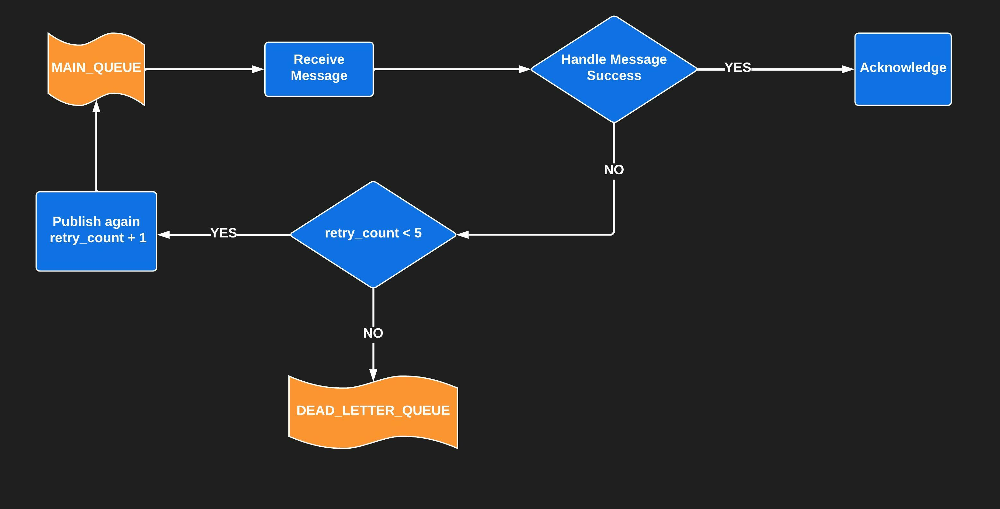

<html>
<h1>RabbitMQ Handler for Python - by Alex diPaoli</h1>

<h2>Instalation</h2>
<p>
Add this requirement to your project: </p>
<p>

```python
alex-rabbitMQ-broker @ git+https://<user+password or token>@github.com/<your_organization>/alex-rabbitMQ-broker.git
```
</p>
<p>
Then use <code>pip install -r requirements.txt</code> to install all requirements.
</p>


<br>
<h1>Basic Usage</h1>
<p>
To use, simply create a Consumer and call the <code>Consumer.consume()</code> method.
You must create a method to handle received messages, like this:
</p>
<p>
Example:

```python
from rabbit_broker.consumer import RabbitConsumer

def handle_message(body):
    print(body)

consumer = RabbitConsumer(queue="basic_queue", task=handle_message)
consumer.consume()
```

You can publish messages into this queue using the <code>Publisher</code> class, like this:
```python
from rabbit_broker.publisher import RabbitPublisher


publisher = RabbitPublisher(queue="basic_queue", message="Test message using Erik!")
publisher.publish()
print('Message published!')
```
</p>


<br>
<h1>Retry Usage</h1>
<p>
To use the Retry workflow you must:</p>
<p>
<ul>
<li>Declare <code>use_retry=True</code> to Enable retry behavior.</li>
<li>Declare auto_acknowledge=False to allow RetryPublisher class to handle the acknowledgements.</li>
<li>In this mode, the <code>handle_message</code> method must receive an instance of <code>consumer.BasicMessage</code>, which will carry content and handlers of the rabbit message.</li>
</ul>
</p>


<p>
Example:


```python
from rabbit_broker.consumer import BasicMessage, RabbitConsumer
from rabbit_broker.retry_publisher import RetryPublisher


def handle_message(message: BasicMessage):
    print("MESSAGE RECEIVED: ", message.body)
    print(f"RETRY_COUNT: {message.retry_count}")

    if <condition to retry>:
        RetryPublisher(consumer, message)
    else: message.channel.basic_nack(delivery_tag=message.method.delivery_tag,
        requeue=False)


consumer = RabbitConsumer(
    queue="retry_example_queue",
    task=handle_message,
    use_retry = True,
    auto_acknowledge=False
    )
consumer.consume()
```
</p>
<p>
<ul>
<li>
The <code>RetryPublisher</code> works by publishing a new message to the same queue on each retry, then it nacks (<code>consumer.basic_nack</code>) for the actual message, which will be descarded. When the retry_count is exceded, the message will be published in the <code>dead_letter_queue</code> declared on the consumer call, and also nacks the actual message. Therefore, every retry is simply a new message with retry_count + 1.
</li>
<li>
As you see in this example, you can handle <code>basic_ack</code> or <code>basic_nack </code> whenever you see fit, by using the channel passed in the message object. However, keep in mind the <code>RetryPublisher</code> already nacks all messages, assuming that if they are being retryed, the process reach some failure. If you ever need an to confirm the acknowledge, you must call it manually (except on the basic mode, when the auto_acknowledge is True by defaut).
</li>
<li>Extra parameters can be customized using kwargs. See the <code>Consumer and Publisher</code> classes docstrings for details.
</ul>
</p>
<br>
<h2>Retry Workflow Chart</h2>
</img>


</html>